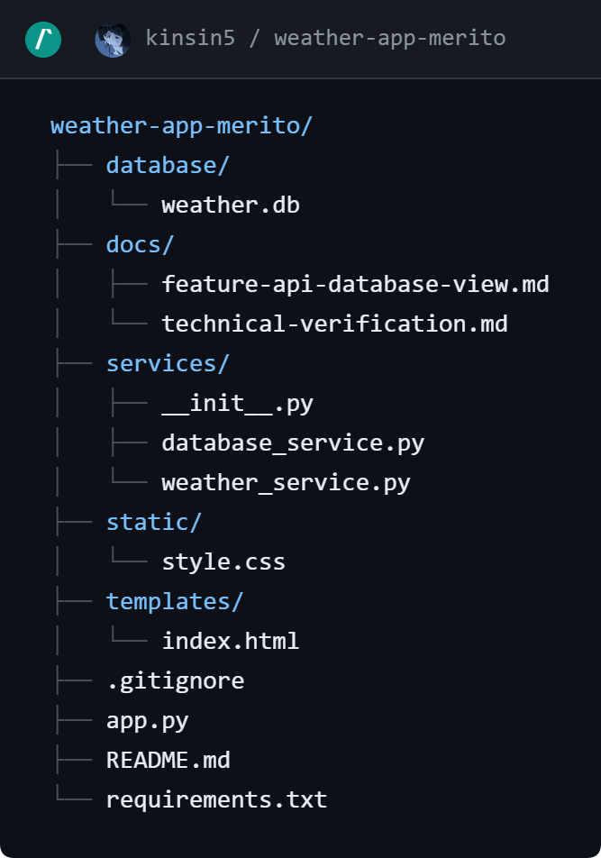

# weather-app-merito
Project for my Jezyki Programowania final project 

Polish specification below :)

# Specyfikacja projektu - WeatherApp

## 1. Krótki opis projektu

Celem projektu jest stworzenie prostej aplikacji webowej umożliwiającej sprawdzenie aktualnej pogody dla wybranego miasta. Użytkownik wpisuje nazwę miejscowości w formularzu, a system pobiera dane z zewnętrznego API pogodowego i prezentuje je w czytelnej formie na stronie internetowej.

Projekt zostanie wykonany w języku Python z wykorzystaniem frameworka Flask. Warstwa widoku zostanie przygotowana przy użyciu HTML i CSS, natomiast logika pobierania danych pogodowych zostanie wydzielona do osobnego modułu aplikacji.

## 2. Cel projektu

Celem aplikacji jest umożliwienie szybkiego sprawdzenia podstawowych informacji pogodowych bez konieczności korzystania z wielu różnych serwisów internetowych. Aplikacja ma być prosta, czytelna i łatwa w obsłudze.

## 3. Wymagania funkcjonalne

1. System umożliwia użytkownikowi wpisanie nazwy miasta w formularzu wyszukiwania.
2. System pobiera współrzędne geograficzne miasta na podstawie wpisanej nazwy.
3. System pobiera aktualne dane pogodowe z zewnętrznego API.
4. System wyświetla użytkownikowi podstawowe informacje pogodowe, takie jak temperatura, temperatura odczuwalna, wilgotność oraz prędkość wiatru.
5. System informuje użytkownika o błędzie, jeżeli wpisane miasto nie zostanie znalezione.
6. System informuje użytkownika o błędzie, jeżeli wystąpi problem z połączeniem z API pogodowym.
7. System umożliwia ponowne wyszukanie pogody dla innego miasta bez konieczności restartowania aplikacji.

## 5. Wymagania pozafunkcjonalne

1. Aplikacja powinna działać lokalnie w przeglądarce internetowej.
2. Interfejs użytkownika powinien być prosty, czytelny i intuicyjny.
3. Kod aplikacji powinien być podzielony na warstwę widoku oraz warstwę logiki aplikacji.
4. Nazwy plików, funkcji i zmiennych powinny być zgodne z podstawowymi konwencjami języka Python.

## 6. Potencjalni odbiorcy systemu

1. Osoby, które chcą szybko sprawdzić aktualną pogodę w swoim mieście.
2. Użytkownicy, którzy potrzebują prostego narzędzia do sprawdzania podstawowych informacji pogodowych.

## 7. Korzyści dla użytkowników końcowych

1. Szybki dostęp do aktualnych informacji pogodowych.
2. Prosty i czytelny sposób prezentacji danych.
3. Brak konieczności instalowania dodatkowej aplikacji system działa w przeglądarce.

## 8. Technologie

* Python
* Flask
* HTML
* CSS
* requests
* SQLite
* Open-Meteo API

## 9. Zakres projektu

W podstawowym zakresie aplikacja będzie umożliwiała wyszukanie miasta i wyświetlenie aktualnej pogody. Projekt nie będzie systemem produkcyjnym, lecz prostą aplikacją edukacyjną pokazującą wykorzystanie języka Python, frameworka Flask, zewnętrznego API oraz podziału kodu na logiczne części.

## 10. Planowana struktura aplikacji

DODAJ STRUKTURE!!

## 11. Separacja logiki od widoku

Projekt będzie posiadał prosty podział odpowiedzialności:

* plik `app.py` będzie odpowiadał za uruchomienie aplikacji Flask oraz obsługę żądań użytkownika,
* plik `weather_service.py` będzie odpowiadał za komunikację z API pogodowym i przygotowanie danych,
* pliki HTML w katalogu `templates` będą odpowiadały za prezentację danych użytkownikowi,
* plik CSS w katalogu `static` będzie odpowiadał za wygląd aplikacji.

Dzięki temu kod będzie czytelniejszy, łatwiejszy do utrzymania i zgodny z zasadą oddzielenia logiki aplikacji od warstwy widoku.